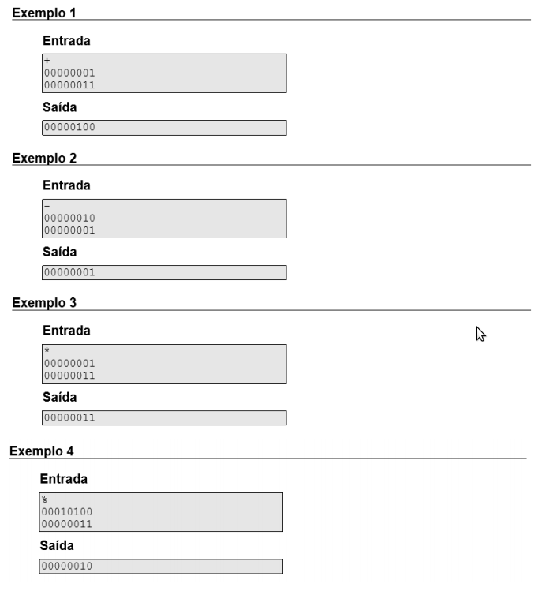
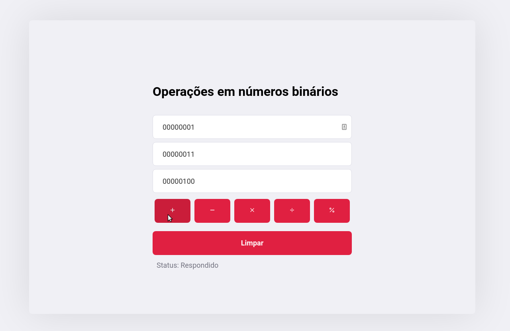

# digistarts

Teste para vaga Desenvolvedor Home Office na Digistarts

## Tabela de Conteúdo

<!--ts-->

- [Tabela de Conteúdo](#tabela-de-conteudo)
- [Descrição](#Descrição)
- [Pré-requisitos](#pré-requisitos)
- [Rodando o Back End](#rodando-o-back-end)
- [Estrutura de Arquivos](#estrutura-de-arquivos)
- [Tests](#testes)
- [Demonstração da aplicação](#demonstração-da-aplicação)
  - [Rotas](#rotas)
  - [Resposta](#resposta)
  - [Mensagens de Erro](#mensagens-de-erro)
  - [Frontend](#frontend)
- [Tecnologias](#tecnologias)
- [License](#license)
- [Autor](#autor)
<!--te-->

## Descrição

Problema da operação entre números binários:
Faça um programa capaz de operar dois números de 0-255 informados em binário.
A resposta deve ser dada também em binário.
Deve-se aceitar os operadores abaixo:
+,-,\*,/,%

<h1 align="center">
  
</h1>

## Pré-requisitos

Antes de começar, você vai precisar ter instalado em sua máquina as seguintes ferramentas:
[Git](https://git-scm.com), [Node.js](https://nodejs.org/en/).
Além disso é bom ter um editor para trabalhar com o código como [VSCode](https://code.visualstudio.com/)

## Rodando o Back End

```bash
# Clone este repositório
$ git clone https://github.com/brlga002/digistarts.git

# Acesse a pasta do projeto no terminal/cmd
$ cd digistarts

# Instale as dependências
$ npm install

# Execute a aplicação em modo de desenvolvimento
$ npm run dev

# Ou execute aplicação em modo de produção
$ npm run start

# O servidor inciará na porta:3000 - acesse http://localhost:3000
```

## Estrutura de Arquivos

A estrutura de arquivos está da seguinte maneira:

```bash
digistarts
├── .eslintrc.json
├── frontend
│   ├── sourceCodeFrontend
├── github
│   ├── frontend.png
│   └── problema.png
├── .gitignore
├── Insomnia_routers.json
├── jest.config.js
├── package.json
├── prettier.config.js
├── public
│   ├── stacticFrontendFiles
├── README.md
├── src
│   ├── app.js
│   ├── controllers
│   │   └── mathController.js
│   ├── index.js
│   ├── middleware
│   │   └── allowDigits.js
│   ├── routes
│   │   └── mathRouter.js
│   └── utils
│       └── leftPad.js
├── tests
│   ├── integration
│   │   ├── messagesErro.spec.js
│   │   └── operations.spec.js
│   └── unit
│       └── gerateLeftPad.spec.js
└── .vscode
    └── settings.json
```

## Testes

Para executar os testes unitários e de integração rode o comando:

```bash
$ npm test
```

## Demonstração da aplicação

Esta API aceita o método POST solicitação para se comunicar e códigos de resposta HTTP para identificar o status e os erros.

Todas as respostas vêm em JSON padrão.

Todas as solicitações devem incluir um content-typede application/json e o corpo deve ser um JSON válido.

Para testar o endpoint iniciar um servidor local <http://localhost:3000> ou ultilizar o servidor online <https://digistarts.herokuapp.com>.

Na raiz do projeto existe o arquivo Insomnia_routers.json com exemplo de todas as rotas [Insomnia Core](https://insomnia.rest/download/).

### Rotas

A url do servidor será chamada no exemplo de Rotas abaixo de base_url

- base_url/soma
  Retorna soma entre dois números binários
- base_url/subtracao
  Retorna subtração entre dois números binários
- base_url/multiplicacao
  Retorna multiplicação entre dois números binários
- base_url/divisao
  Retorna divisão entre dois números binários
- base_url/resto
  Retorna o resto da divisão entre dois números binários

Todas as rotas exigem os campos fistNumber e secondNumber. Exemplo de JOSN válido:

```bash
{
	"fistNumber":"10000000",
	"secondNumber":"100000000"
}
```

### Resposta:

Respota da solicitação na rota base_url/soma.

Corpo da solicitação:

```bash
{
"fistNumber":"00000001",
"secondNumber":"00000011"
}
```

Resposta:

```bash
{
	"00000100"
}
```

### Mensagens de Erro:

Quando não informado um JSON válido

```bash
{
  "statusCode": 400,
  "error": "Bad Request",
  "message": "\"fistNumber\" is required",
  "validation": {
    "source": "body",
    "keys": [
      "fistNumber"
    ]
  }
}
```

Quando fistNumber não é um binário:

```bash
{
  "message": "the fistNumber must be a binary"
}
```

Quando secondNumber não é um binário:

```bash
{
  "message": "the secondNumber must be a binary"
}
```

Quando fistNumber não esta entre 0 e 255:

```bash
{
  "message": "the fistNumber must be 0 to 255"
}
```

Quando secondNumber não esta entre 0 e 255:

```bash
{
  "message": "the secondNumber must be 0 to 255"
}
```

Quando secondNumber é maior o fistNumber nas operações de subtração, divisão e resto da divisão :

```bash
{
  "message": "the second number cannot be greater than the first in this operation"
}
```

### Frontend

O frontend não fazia parte dos requisitos do projeto, entretanto para facilitar o teste da API ele esta disponível em: <https://digistarts.herokuapp.com>

<h1 align="center">
	<a href="https://digistarts.herokuapp.com"  title="Server app" target="_blank">
  		
	</a>
</h1>

## Tecnologias

As seguintes ferramentas foram usadas na construção do projeto:

- [Node.js](https://nodejs.org/en/)
- [Nodemon](https://www.npmjs.com/package/nodemon)
- [Celebrate](https://github.com/arb/celebrate)
- [Jest](https://jestjs.io/docs/en/getting-started)
- [SuperTest](https://www.npmjs.com/package/supertest)
- [Insomnia Core](https://insomnia.rest/download/)
- [React](https://devdocs.io/react/)

## License

MIT License

Copyright (c) <2020> <Gabriel Fernandes Lima>

Permission is hereby granted, free of charge, to any person obtaining a copy
of this software and associated documentation files (the "Software"), to deal
in the Software without restriction, including without limitation the rights
to use, copy, modify, merge, publish, distribute, sublicense, and/or sell
copies of the Software, and to permit persons to whom the Software is
furnished to do so, subject to the following conditions:

The above copyright notice and this permission notice shall be included in all
copies or substantial portions of the Software.

THE SOFTWARE IS PROVIDED "AS IS", WITHOUT WARRANTY OF ANY KIND, EXPRESS OR
IMPLIED, INCLUDING BUT NOT LIMITED TO THE WARRANTIES OF MERCHANTABILITY,
FITNESS FOR A PARTICULAR PURPOSE AND NONINFRINGEMENT. IN NO EVENT SHALL THE
AUTHORS OR COPYRIGHT HOLDERS BE LIABLE FOR ANY CLAIM, DAMAGES OR OTHER
LIABILITY, WHETHER IN AN ACTION OF CONTRACT, TORT OR OTHERWISE, ARISING FROM,
OUT OF OR IN CONNECTION WITH THE SOFTWARE OR THE USE OR OTHER DEALINGS IN THE
SOFTWARE.

## Autor

---

<a href="https://github.com/brlga002" target="_blank">
 
 <br />
 <sub>
  <b>Gabriel Fernandes</b>
</sub></a>

<a href="https://github.com/brlga002" title="Gabriel Github link" target="_blank">🚀</a>

Feito com ❤️ por Gabriel Fernandes 🏽 Entre em contato!

[](https://www.linkedin.com/in/gabriel-lima-983701141)
[](mailto:gabriel@devmanaus.com)
[![badge](https://img.shields.io/badge/Whatsapp-99772008-E66581.svg?logo=data:image/png;base64,iVBORw0KGgoAAAANSUhEUgAAAFkAAABZCAMAAABi1XidAAAB8lBMVEX///9XmsrmZYH1olJXmsr1olJXmsrmZYH1olJXmsr1olJXmsrmZYH1olL1olJXmsr1olJXmsrmZYH1olL1olJXmsrmZYH1olJXmsr1olL1olJXmsrmZYH1olL1olJXmsrmZYH1olL1olL0nFf1olJXmsrmZYH1olJXmsq8dZb1olJXmsrmZYH1olJXmspXmspXmsr1olL1olJXmsrmZYH1olJXmsr1olL1olJXmsrmZYH1olL1olLeaIVXmsrmZYH1olL1olL1olJXmsrmZYH1olLna31Xmsr1olJXmsr1olJXmsrmZYH1olLqoVr1olJXmsr1olJXmsrmZYH1olL1olKkfaPobXvviGabgadXmsqThKuofKHmZ4Dobnr1olJXmsr1olJXmspXmsr1olJXmsrfZ4TuhWn1olL1olJXmsqBi7X1olJXmspZmslbmMhbmsdemsVfl8ZgmsNim8Jpk8F0m7R4m7F5nLB6jbh7jbiDirOEibOGnKaMhq+PnaCVg6qWg6qegKaff6WhnpKofKGtnomxeZy3noG6dZi+n3vCcpPDcpPGn3bLb4/Mb47UbIrVa4rYoGjdaIbeaIXhoWHmZYHobXvpcHjqdHXreHLroVrsfG/uhGnuh2bwj2Hxk17yl1vzmljzm1j0nlX1olL3AJXWAAAAbXRSTlMAEBAQHx8gICAuLjAwMDw9PUBAQEpQUFBXV1hgYGBkcHBwcXl8gICAgoiIkJCQlJicnJ2goKCmqK+wsLC4usDAwMjP0NDQ1NbW3Nzg4ODi5+3v8PDw8/T09PX29vb39/f5+fr7+/z8/Pz9/v7+zczCxgAABC5JREFUeAHN1ul3k0UUBvCb1CTVpmpaitAGSLSpSuKCLWpbTKNJFGlcSMAFF63iUmRccNG6gLbuxkXU66JAUef/9LSpmXnyLr3T5AO/rzl5zj137p136BISy44fKJXuGN/d19PUfYeO67Znqtf2KH33Id1psXoFdW30sPZ1sMvs2D060AHqws4FHeJojLZqnw53cmfvg+XR8mC0OEjuxrXEkX5ydeVJLVIlV0e10PXk5k7dYeHu7Cj1j+49uKg7uLU61tGLw1lq27ugQYlclHC4bgv7VQ+TAyj5Zc/UjsPvs1sd5cWryWObtvWT2EPa4rtnWW3JkpjggEpbOsPr7F7EyNewtpBIslA7p43HCsnwooXTEc3UmPmCNn5lrqTJxy6nRmcavGZVt/3Da2pD5NHvsOHJCrdc1G2r3DITpU7yic7w/7Rxnjc0kt5GC4djiv2Sz3Fb2iEZg41/ddsFDoyuYrIkmFehz0HR2thPgQqMyQYb2OtB0WxsZ3BeG3+wpRb1vzl2UYBog8FfGhttFKjtAclnZYrRo9ryG9uG/FZQU4AEg8ZE9LjGMzTmqKXPLnlWVnIlQQTvxJf8ip7VgjZjyVPrjw1te5otM7RmP7xm+sK2Gv9I8Gi++BRbEkR9EBw8zRUcKxwp73xkaLiqQb+kGduJTNHG72zcW9LoJgqQxpP3/Tj//c3yB0tqzaml05/+orHLksVO+95kX7/7qgJvnjlrfr2Ggsyx0eoy9uPzN5SPd86aXggOsEKW2Prz7du3VID3/tzs/sSRs2w7ovVHKtjrX2pd7ZMlTxAYfBAL9jiDwfLkq55Tm7ifhMlTGPyCAs7RFRhn47JnlcB9RM5T97ASuZXIcVNuUDIndpDbdsfrqsOppeXl5Y+XVKdjFCTh+zGaVuj0d9zy05PPK3QzBamxdwtTCrzyg/2Rvf2EstUjordGwa/kx9mSJLr8mLLtCW8HHGJc2R5hS219IiF6PnTusOqcMl57gm0Z8kanKMAQg0qSyuZfn7zItsbGyO9QlnxY0eCuD1XL2ys/MsrQhltE7Ug0uFOzufJFE2PxBo/YAx8XPPdDwWN0MrDRYIZF0mSMKCNHgaIVFoBbNoLJ7tEQDKxGF0kcLQimojCZopv0OkNOyWCCg9XMVAi7ARJzQdM2QUh0gmBozjc3Skg6dSBRqDGYSUOu66Zg+I2fNZs/M3/f/Grl/XnyF1Gw3VKCez0PN5IUfFLqvgUN4C0qNqYs5YhPL+aVZYDE4IpUk57oSFnJm4FyCqqOE0jhY2SMyLFoo56zyo6becOS5UVDdj7Vih0zp+tcMhwRpBeLyqtIjlJKAIZSbI8SGSF3k0pA3mR5tHuwPFoa7N7reoq2bqCsAk1HqCu5uvI1n6JuRXI+S1Mco54YmYTwcn6Aeic+kssXi8XpXC4V3t7/ADuTNKaQJdScAAAAAElFTkSuQmCC)](https://api.whatsapp.com/send?phone=559299772008&text=Ola%2C%20gabriel%20vi%20seu%20numero%20no%20github.)
